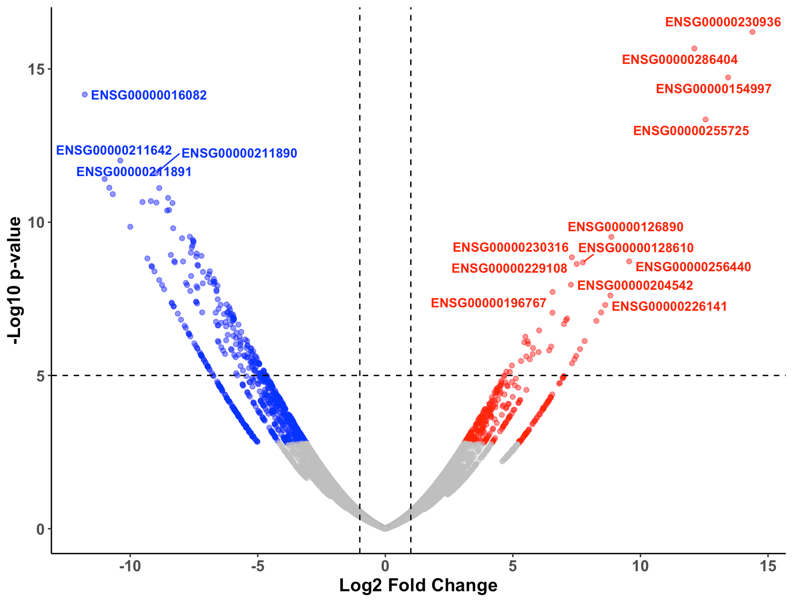
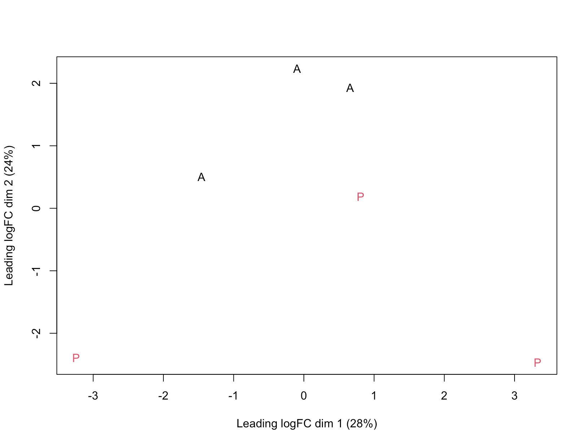

# 🧬 Gene Expression Analysis of Glioblastoma in Adults vs Children

> **Project Title:** Regulatory Differences in Glioblastoma in Adults vs. Children
> **Author:** Kenneth Chen, Sophia Nguyen, Andrew Robinson  
> **Affiliation:** iTCGA Cancer Research Workshop 2025  
> **Date:** June 2025
> [🔗 View Presentation](https://www.canva.com/design/DAGqiSK-aLY/-jHqYrcWF28CwezMRpAMBQ/edit?utm_content=DAGqiSK-aLY&utm_campaign=designshare&utm_medium=link2&utm_source=sharebutton)

---

## 📌 Project Overview

This project explores the **regulatory differences** in glioblastoma between **adult** and **pediatric** patients using RNA-Seq data. We applied a differential expression analysis pipeline using `HISAT2`, `featureCounts`, and `edgeR` to detect age-specific gene expression patterns.

> **Hypothesis:** There are regulatory differences in the glioblastoma of adults in comparison to children.

---

## 🧪 Objectives

- Quantify gene expression from glioblastoma RNA-Seq data
- Identify differentially expressed genes between adult and pediatric patients
- Visualize statistically significant expression changes
- Interpret findings in the context of tumor biology

---

## 🧰 Tools & Libraries

| Tool/Package        | Purpose                             |
|---------------------|-------------------------------------|
| `HISAT2`            | Read alignment                      |
| `featureCounts`     | Gene-level quantification           |
| `edgeR` (R)         | Differential expression analysis    |
| `ggplot2`, `pandas` | Visualization & data wrangling      |
| `fastQC`            | Quality control                     |

---

## 🗃️ Dataset

- **Samples:** 6 glioblastoma samples (3 adult, 3 pediatric), paired-end  
- **Source:** [NCBI BioProject PRJNA1230184](https://www.ncbi.nlm.nih.gov/bioproject/?term=PRJNA1230184)  
- **Reference Genome:** `Homo_sapiens.GRCh38.111.gtf`

---

## 📂 Project Structure

```
.
├── data/
│   ├── counts.txt
│   └── topGenes.tsv
├── results/
│   ├── Rplot.png
│   └── Volcano_Plot.png
├── scripts/
│   ├── alignment.sh
│   └── counts.R
├── README.md
└── SraRunTable.csv
```

---

## 📊 Results

### Volcano Plot  



> Genes with |log₂FC| > 2 and FDR < 0.05 were considered significantly differentially expressed.

---

### 🧬 Top Differentially Expressed Genes

| GeneID          | logFC | FDR     | Status        |
|------------------|--------|----------|----------------|
| ENSG00000041982  |  3.21  | 0.00004  | Upregulated    |
| ENSG00000123456  | -2.87  | 0.00015  | Downregulated  |

See full results in [`data/topGenes.tsv`](./data/topGenes.tsv)

---

### 🔬 Interpretation

- **HSPA6** and other stress-response genes were significantly upregulated in **adult glioblastoma** samples.
- **Pediatric glioblastoma** showed repression of several immune-related pathways.
- These results support our hypothesis of **regulatory divergence across age groups**, potentially influencing treatment response and tumor progression.

---

## 🚀 How to Reproduce

```bash
# 1. Align reads using HISAT2
bash scripts/alignment.sh

# 2. Run differential expression analysis in R
Rscript scripts/counts.R
```

---

## 📚 References

Ahmed, A. A., Alturkistani, A., Alabed, Y. Z., Elawad, M. E., & Nagi, A. (2025). Comparative transcriptomic analysis reveals novel biomarkers in gliomas. *Acta Neuropathologica Communications, 13*(1), 100. https://doi.org/10.1186/s40478-025-01961-w

Masliah-Planchon, J., Bauchet, L., & Sanson, M. (2021). Pediatric and adult low-grade gliomas: Where do the differences lie? *Children, 8*(11), 1075. https://doi.org/10.3390/children8111075

National Cancer Institute. (n.d.). *Childhood astrocytomas treatment (PDQ®)–Patient version*. National Institutes of Health. Retrieved June 18, 2025, from https://www.cancer.gov/types/brain/patient/childhood-glioma-astrocytoma

National Center for Biotechnology Information. (n.d.). *PRJNA1230184: Transcriptomic profiling of pediatric gliomas*. NCBI BioProject. Retrieved June 18, 2025, from https://www.ncbi.nlm.nih.gov/bioproject/?term=PRJNA1230184

Das, K. K. (2017, September 27). Pediatric glioblastoma. Glioblastoma [Internet]. https://www.ncbi.nlm.nih.gov/books/NBK469983/#:~:text=As%20per%20the%20Central%20Brain,%2Dgrade%20gliomas%20(22). 

Schaff, L. R., & Mellinghoff, I. K. (2023, February 21). Glioblastoma and other primary brain malignancies in adults: A Review. JAMA. https://pmc.ncbi.nlm.nih.gov/articles/PMC11445779/ 


---
